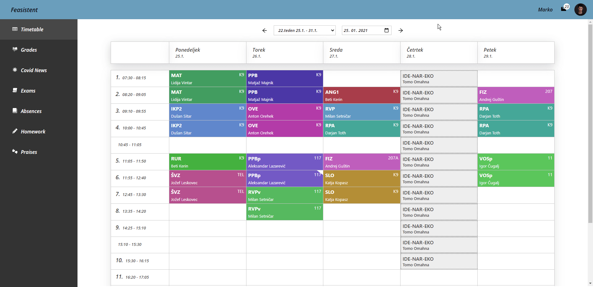

<h1>Technologies</h1>
<ul>
  <li>React, Hooks</li>
  <li>Styled Components</li>
  <li>Redux (Redux Toolkit), Thunk</li>
  <li>Express</li>
  <li>Cheerio (web scraping)</li>
</ul>
<h1>Hosting</h1>
  
Frontend - Static hosting on Netlify

  
Backend - Netlify's AWS lambda functions

<h1>UI</h1>

<h1>Sortable Navigation</h1>

<h1>Mobile Friendly</h1>

<h1>Custom Color Scheme</h1>

